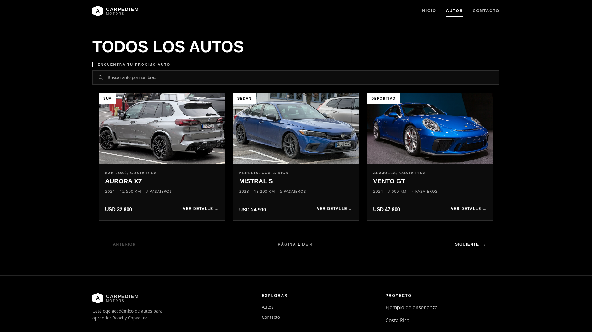
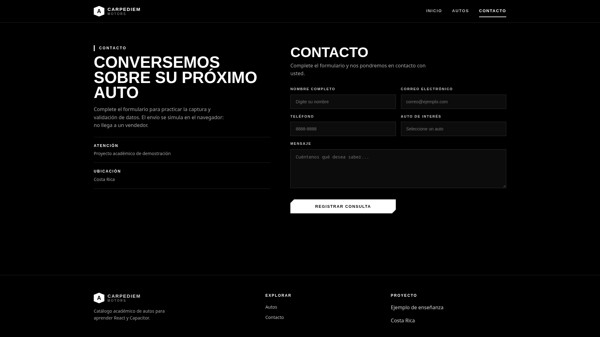

# Carpediem Motors — Catálogo Académico de Autos

> **Academic project — not a real dealership.** This is a React practice project built for learning purposes. No real cars are sold, no form data is sent to a seller, and all catalog data is local/simulated.

## Screenshots

### 1. Inicio — Hero "Puro placer de conducir"


Landing page with full-width hero, brand navbar (`Inicio / Autos / Contacto`), and CTAs to explore models.

### 2. Autos — Catálogo con búsqueda y paginación


Catalog page (`/cars`) with:
- Search by name
- Card grid with category, location, year, km, passengers, price in USD
- Pagination (`Página 1 de 4`)

### 3. Contacto — Formulario simulado


Contact page (`/contact`) with controlled form validation. Submission is only simulated in the browser (`console.log`), it does not contact a seller.

## What This Project Is

- **Course:** React workshop / practice (`taller1`)
- **Goal:** Practice React + TypeScript with routing, forms, search, pagination, and modular CSS.
- **Fictional brand:** Carpediem Motors, Costa Rica.
- **Data source:** Local JSON at `public/data/Cars.json`, images at `public/images/`. No backend, no database, no API.
- **Footer disclaimer in the app itself:** "Catálogo académico de autos para aprender React y Capacitor."

## Tech Stack

- React 19 + TypeScript
- Vite 8 (dev server + build)
- react-router-dom 7 (routes: `/`, `/cars`, `/cars/:id`, `/contact`, `*`)
- react-hook-form 7 (contact form)
- CSS Modules (`*.module.css` per page/component)
- ESLint + TypeScript ESLint

## Features

1. **Home (`/`):**
   - `Hero.tsx` — full-screen presentation + CTA to `/cars`.
   - `Experience.tsx` — secondary brand/feature section.

2. **Cars catalog (`/cars`):**
   - `Cars.tsx` — filters `Cars.json` by name, resets pagination on search.
   - `SearchBar.tsx` — controlled search input.
   - `CarCardList.tsx` + `CardCar.tsx` — 3 cards per page.
   - `Pagination.tsx` — previous/next with `currentPage / totalPages`.
   - Empty state: "No encontramos autos con ese nombre."

3. **Car detail (`/cars/:id`):**
   - `CarDetail.tsx` + `CarHero.tsx`, `CarFeature.tsx`, `CarPurchaseCard.tsx`, `CardInfo.tsx`.
   - Shows specs and link to `/contact?car=<name>` to pre-fill interest.

4. **Contact (`/contact`):**
   - `ContactForm.tsx` — `useForm` + `useSearchParams` to pre-fill "auto de interés".
   - `ContactInfo.tsx` — clarifies: capture/validation practice, simulated submit.
   - `onSubmit` currently only does `console.log(data)`.

5. **Shared layout:**
   - `Layout.tsx`, `Navbar.tsx`, `Footer.tsx`, `Logo.tsx`, `NotFound.tsx`, `Logout.tsx`.
   - `useFetch.ts` hook example.

## Project Structure

```
carpediem-motors/
  public/
    data/Cars.json       # local catalog data
    images/              # car images
  docs/
    screenshots/         # home.png, cars.png, contact.png
  src/
    app/App.tsx          # Routes definition
    main.tsx             # Vite entry + BrowserRouter
    index.css
    features/
      home/pages + components
      cars/pages + components + types/Car.ts
      contact/pages + components
      shared/components + layout + hooks
  README.md
  vite.config.ts
  tsconfig*.json
  eslint.config.js
```

## Getting Started

Requirements: Node.js 20+, npm or pnpm.

```bash
# install
npm install
# or
pnpm install

# dev server
npm run dev
# or
pnpm dev

# production build + preview
npm run build
npm run preview

# lint
npm run lint
```

Open `http://localhost:5173`.

## Academic Notes / Limitations

- No authentication, no payments, no real contact backend.
- Prices, locations (San José, Heredia, Alajuela, Costa Rica), km and stock are fictional.
- Form validation is basic (`required` on name in current code).
- No tests configured yet.
- Capacitor mentioned in footer as learning goal, not implemented in this repo version.

## License / Use

Free for academic and demonstration use. If you reuse this template, keep the academic disclaimer visible.
